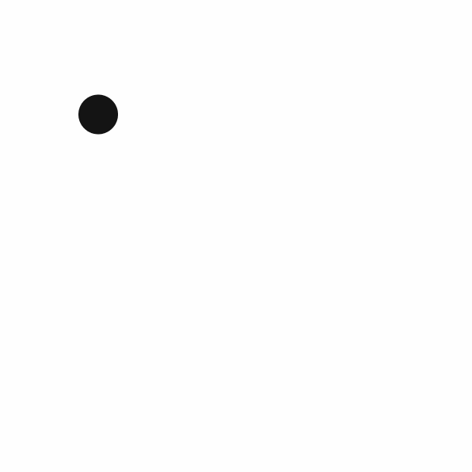
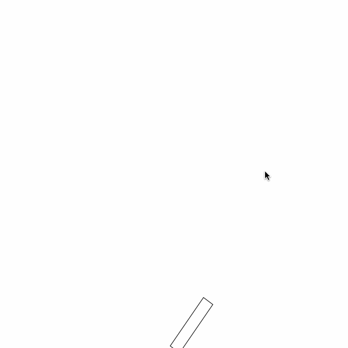
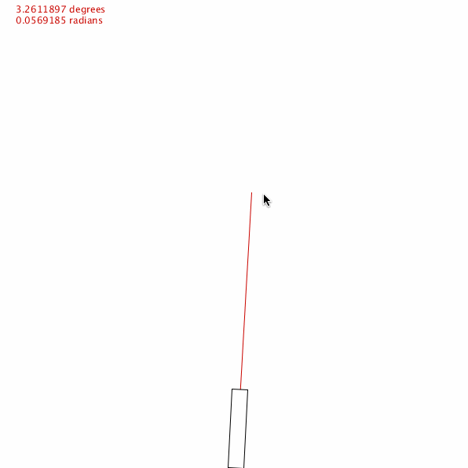
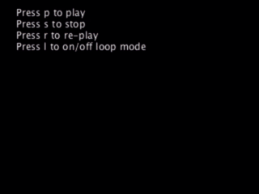

# Processing Snippets for Students

1- **falling_things**: Set of objects inside an ArrayList falling down from top of the application window. When one of the objects reach to the bottom, its x position calculated via random function and y position is set to top and so on...

---
2- **jumping_action_keyboard**: Simulates basics of gravity affect on a display object. Usefull for mini games in order to simulate jumping action.  

---
3- **rotate_with_mouse**: Rotates the related display object according to x position of the mouse.

---
4- **rotate_with_mouse_to_point**: Rotates the related display object according to x and y position of the mouse.

---
5- **loadAndPlayVideo**: Loads the video specified in the sketch. The user can play, stop, re-play and loop the loaded video via keyboard.

